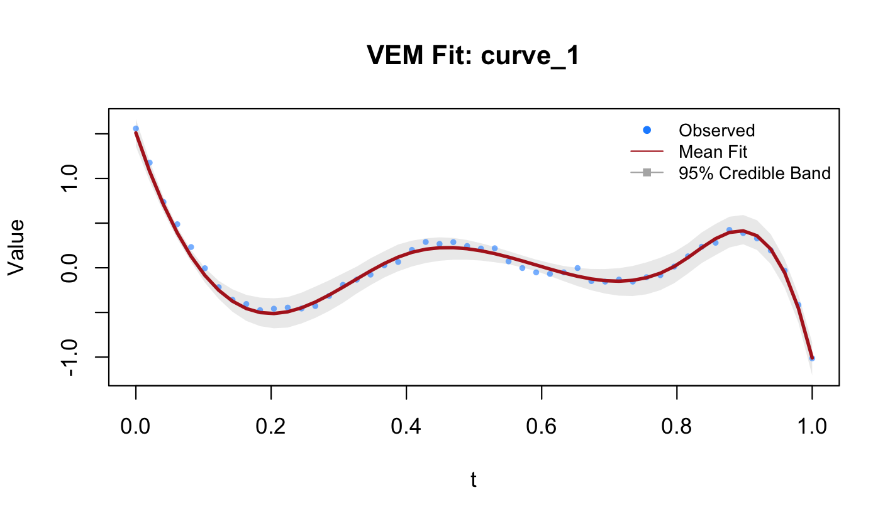

# fda.vi

<!-- badges: start -->

[](https://github.com/steviek16/fda.vi/actions/workflows/R-CMD-check.yaml)
<!-- badges: end -->

**fda.vi** is an R package that implements a variational
expectation-maximization (VEM) algorithm for smoothing one or multiple
functional observations via basis function selection. The algorithm
estimates all model parameters simultaneously and automatically, while
accounting for within-curve correlation. It provides a fast, scalable
alternative to Bayesian sampling-based MCMC methods for smoothing
functional curves with within-curve correlated errors via an
Ornstein-Uhlenbeck covariance function.

The details of the variational EM algorithm can be found in da Cruz, de
Souza and Sousa (2024). 

## Installation

``` r
# install.packages("devtools")
devtools::install_github("desouzalab/fda.vi")
```

## Quick Start

``` r
library(fda.vi)

data(toy_curves)
set.seed(1234)

fit <- vem_fit(
  y      = toy_curves$y,
  Xt     = toy_curves$Xt,
  K      = 8,
  center = FALSE,
  scale  = FALSE
)
```

``` r
summary(fit)
#> ------------------------------------------------
#>  VEM Smooth Fit Summary
#> ------------------------------------------------
#> Basis Type            cubic_bspline 
#> Curves (m):           3 
#> Basis Functions (K):  8 
#> Active Bases (per curve): 6, 6, 6 
#> 
#> Model Parameters (Representative):
#>   Point estimate for decay parameter (w): 6.217 
#> 
#>   Posterior q(sigma^2) ~ IG(delta1, delta2):
#>    delta1 (shape):  97 
#>     delta2 (scale):  0.859869 
#> 
#>   Posterior q(tau^2) ~ IG(lambda1, lambda2):
#>     lambda1 (shape): 12.001 
#>    lambda2 (scale): 1517.36 
#> ------------------------------------------------
```

``` r
plot(fit, curve_idx = 1)
```



``` r
coef(fit)
#>      Curve_1    Curve_2    Curve_3
#> B1  1.5105434  1.6158541  1.5027916
#> B2  0.0000000  0.0000000  0.0000000
#> B3 -1.0173887 -1.1296271 -0.9889452
#> B4  0.4855913  0.7182764  0.8098905
#> B5  0.0000000  0.0000000  0.0000000
#> B6 -0.4088634 -0.7414497 -0.5324928
#> B7  1.0851575  1.1127756  1.2152763
#> B8 -1.0093923 -1.1186148 -0.9470451
```

``` r
Xt_new <- seq(0, 1, length.out = 200)
y_pred <- predict(fit, newdata = Xt_new)

head(y_pred[[1]])
#> [1] 1.5105434 1.3985729 1.2903498 1.1858269 1.0849569 0.9876925
```

## Key Features

- **Automatic Bayesian Basis Selection** via a sparsity-inducing prior
  on basis coefficients
- **Uncertainty Quantification** via 95% credible bands, constructed by
  posteriors of the basis coefficients and inclusion indicators
- **Correlated (Within-Curve) Error Structure** modelled explicitly
  using an Ornstein-Uhlenbeck covariance function, with the decay
  parameter estimated automatically via the M-step
- **Automatic Selection of Number of Basis Functions K** via generalized
  cross-validation (GCV) over a user-supplied grid of candidate basis
  sizes
- **Multiple Basis Types** supported: cubic B-splines and Fourier bases
- **S3 User Methods**: `plot()`, `predict()`, `coef()`, and `summary()`
  methods for fitted objects
- **Fast** The variational EM algorithm converges in tens of iterations

## References

da Cruz, A. C., de Souza, C. P. E., & Sousa, P. H. T. O. (2024). Fast
Bayesian basis selection for functional data representation with
correlated errors. *arXiv:2405.20758*.
<https://arxiv.org/abs/2405.20758>

## Citation

To cite the method implemented in this package, please use:

da Cruz, A. C., de Souza, C. P. E., & Sousa, P. H. T. O. (2024). Fast
Bayesian basis selection for functional data representation with
correlated errors. *arXiv:2405.20758*.
<https://arxiv.org/abs/2405.20758>

``` bibtex
@misc{dacruz2024vem,
  title     = {Fast {Bayesian} basis selection for functional data
               representation with correlated errors},
  author    = {da Cruz, Ana Carolina and de Souza, Camila P. E. and
               Sousa, Pedro H. T. O.},
  year      = {2024},
  note      = {arXiv:2405.20758},
  url       = {https://arxiv.org/abs/2405.20758}
}
```
